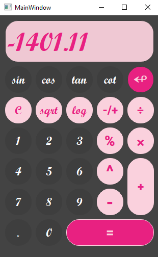

# ***Calculator***

design calculator in **Qt** library!
---
## Qt library
for python is [pyside6](https://www.qt.io/) library

you can install this library:

'''
pip install pyside6
'''

----

## My Calculator ↓
 

 